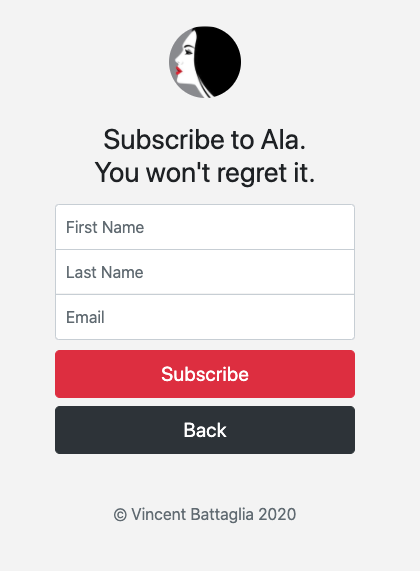
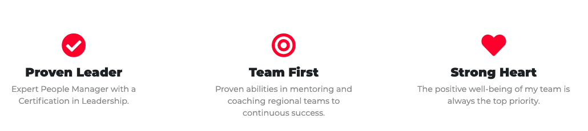
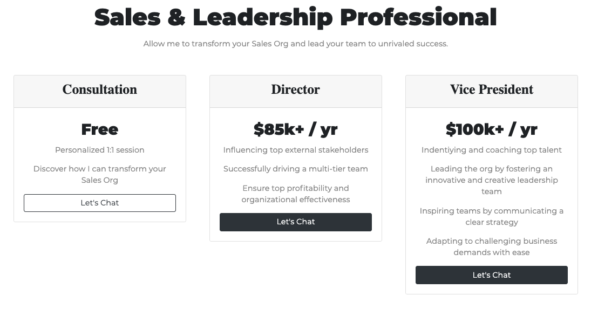

# :dancer: [Ala-Andriuta-App](https://thawing-journey-87460.herokuapp.com/) 

 A stylish web app highlighting the professional accomplishments of a close friend of mine, with built-in functionality to collect user subscriber data via Mongodb + Mailchimp API.

 :telescope: Bootstrap 4 + Javascript ES6 + Mongodb + Mailchimp API
 
 
 

 
 

#### Subscriber page connected to MongoDB Atlas + ultimatley leading to the Mailchimp API:

 
 

#### Attributes to describe the professional:

 
 

#### Displaying one's professional services in a fun, tiered approach that's traditionally used to reference tiered SaaS pricing:

 
 
